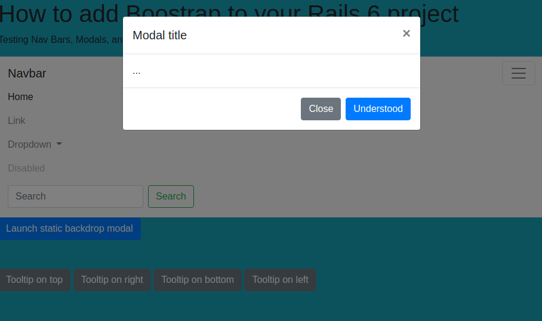

# Add Bootstrap to Rails 6

> I will show you how to add Bootstrap to your project

## Built With

- Ruby
- Rails
- Bootstrap

## Getting Started

**To get a copy of the code please click on the green button on the top right corner that says Code**

### Prerequisites

- Ruby
- Rails
- Yarn

### Install

**Now to clone it to your local machine please open your terminal and paste this code `git@github.com:cvilla714/add-bootstrap-to-rails6.git`**

**Then you can go into the directory by typig `cd add-bootstrap-to-rails6`**

**Finally just type this command `bundle install.` this will install all of the depnedecies for the project**

### Usage

**Once you have gone through the process of installing the code you now run this command `rails s` this will start ther rails server and you can access the project by opening a new tab in your browser and go to http://localhost:3000/**

## Authors

👤 **Cosmel Villalobos**

- Github: [@cvilla714](https://github.com/cvilla714)
- Twitter: [@kckeyti](https://twitter.com/kckeyti)
- LinkedIn: [Cosmel Villalobos](https://www.linkedin.com/in/cosvilla/)

## 🤝 Contributing

Contributions, issues, and feature requests are welcome!

Feel free to check the [issues page](https://github.com/cvilla714/add-bootstrap-to-rails6/pulls).

## Show your support

Give a ⭐️ if you like this project!

## 📝 License

This project is [MIT](https://github.com/cvilla714/add-bootstrap-to-rails6/blob/master/LICENSE) licensed.
